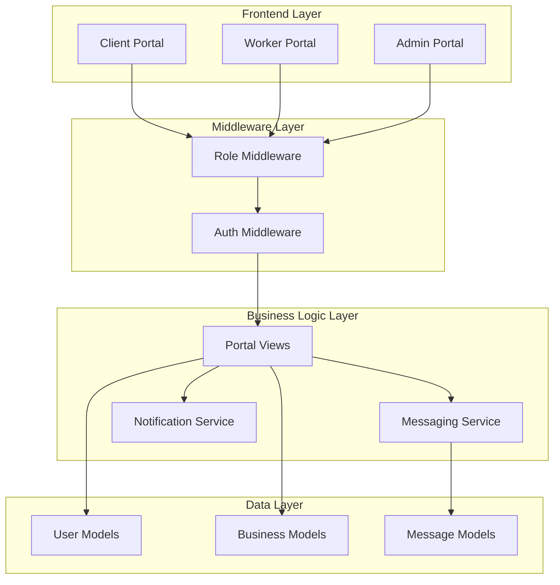
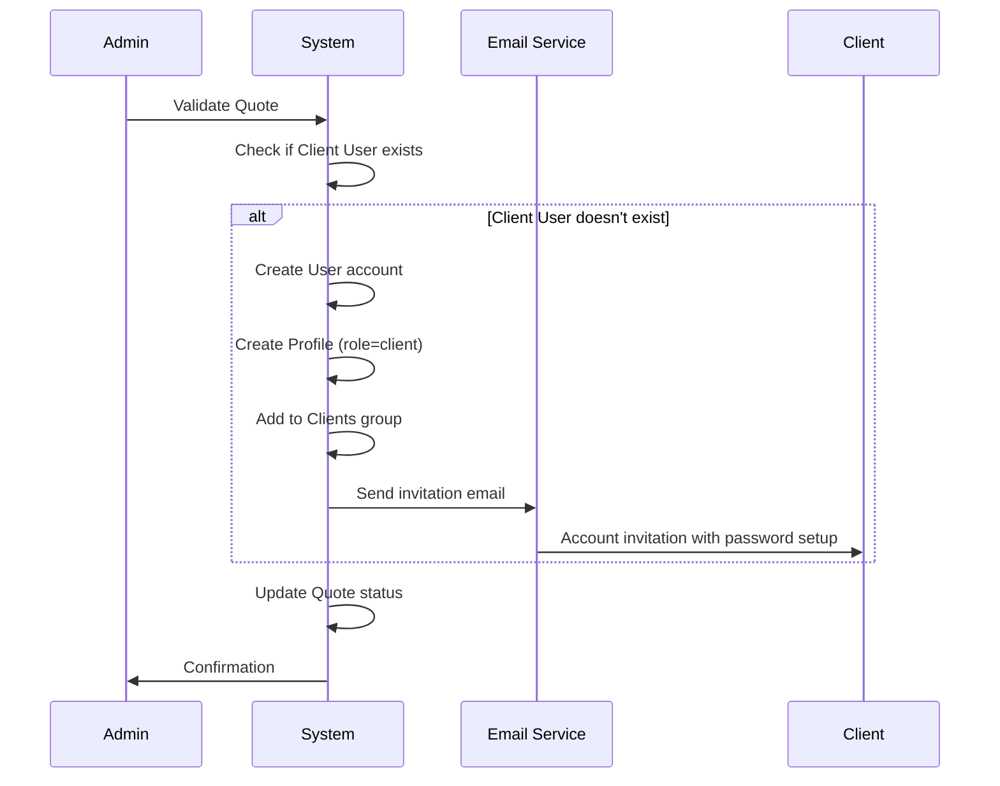
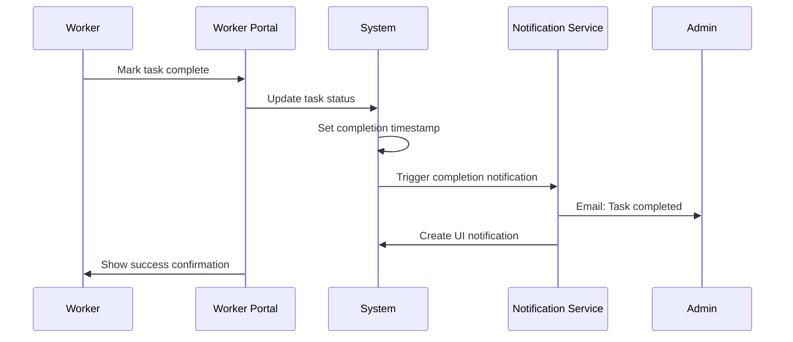

# Design Document - NetExpress v2 Transformation

## Overview

NetExpress v2 transforms the existing Django-based business management system from a traditional admin-only interface into a modern collaborative multi-portal platform. The transformation leverages the existing robust foundation (Django models for quotes, invoices, tasks, and clients) while adding three distinct user experiences: Client Portal, Worker Portal, and Admin Portal.

The design maintains backward compatibility with existing data structures while introducing role-based access control, WYSIWYG messaging capabilities, and mobile-first responsive design. The architecture follows Django best practices with clear separation of concerns between authentication, business logic, and presentation layers.

## Architecture

### High-Level Architecture



### Technology Stack

- **Backend Framework**: Django 4.x (existing)
- **Frontend Enhancement**: TailwindCSS + HTMX for reactive UI
- **Rich Text Editor**: django-ckeditor for WYSIWYG messaging
- **Database**: PostgreSQL (production) / SQLite (development)
- **Authentication**: Django's built-in User model + Groups & Permissions
- **File Storage**: Django's default file handling for PDFs and attachments
- **Email**: Django's email framework with SMTP backend

### Portal Architecture

The system implements three distinct portals sharing the same Django backend but with different views, templates, and access controls:

1. **Client Portal**: Read-only access to personal documents and messaging
2. **Worker Portal**: Task management and status updates with mobile optimization
3. **Admin Portal**: Full system management with existing admin functionality enhanced

## Components and Interfaces

### Authentication and Authorization

#### User Model Extension
```python
# Existing Profile model (accounts/models.py) enhanced
class Profile(models.Model):
    user = models.OneToOneField(User, on_delete=models.CASCADE)
    role = models.CharField(max_length=20, choices=ROLE_CHOICES)
    phone = models.CharField(max_length=50, blank=True)
    
    # New fields for portal functionality
    last_portal_access = models.DateTimeField(null=True, blank=True)
    notification_preferences = models.JSONField(default=dict)
```

#### Role-Based Access Control
- **Django Groups**: "Clients" and "Workers" groups with specific permissions
- **Middleware**: `RoleBasedAccessMiddleware` enforces portal boundaries
- **Decorators**: Custom decorators for view-level access control

### Portal Views and Controllers

#### Client Portal Views
```python
class ClientDashboardView(LoginRequiredMixin, View):
    """Main dashboard showing client's documents and recent activity"""
    
class ClientDocumentListView(LoginRequiredMixin, ListView):
    """Filtered list of quotes and invoices for authenticated client"""
    
class ClientMessageView(LoginRequiredMixin, View):
    """Messaging interface with company"""
```

#### Worker Portal Views
```python
class WorkerDashboardView(LoginRequiredMixin, View):
    """Mobile-optimized task dashboard with calendar view"""
    
class WorkerTaskDetailView(LoginRequiredMixin, DetailView):
    """Task details with completion actions"""
    
class WorkerScheduleView(LoginRequiredMixin, View):
    """Calendar view of assigned tasks"""
```

#### Admin Portal Views
```python
class AdminDashboardView(LoginRequiredMixin, View):
    """Enhanced admin dashboard with KPIs and global overview"""
    
class AdminGlobalPlanningView(LoginRequiredMixin, View):
    """Global task and resource planning interface"""
```

### Messaging System

#### WYSIWYG Integration
```python
# New messaging app models
class Message(models.Model):
    sender = models.ForeignKey(User, on_delete=models.CASCADE)
    recipient = models.ForeignKey(User, on_delete=models.CASCADE)
    subject = models.CharField(max_length=200)
    content = models.TextField()  # Rich HTML content from CKEditor
    created_at = models.DateTimeField(auto_now_add=True)
    read_at = models.DateTimeField(null=True, blank=True)
    
class MessageThread(models.Model):
    """Groups related messages for conversation threading"""
    participants = models.ManyToManyField(User)
    subject = models.CharField(max_length=200)
    last_message_at = models.DateTimeField()
```

#### CKEditor Configuration
```python
# settings.py configuration
CKEDITOR_CONFIGS = {
    'default': {
        'toolbar': 'Custom',
        'toolbar_Custom': [
            ['Bold', 'Italic', 'Underline'],
            ['NumberedList', 'BulletedList'],
            ['Link', 'Unlink'],
            ['RemoveFormat', 'Source']
        ],
        'height': 200,
        'width': '100%',
    }
}
```

### Task Management Enhancement

#### Task Assignment System
```python
# Enhanced Task model (existing tasks/models.py)
class Task(models.Model):
    # Existing fields preserved
    title = models.CharField(max_length=200)
    description = models.TextField(blank=True)
    location = models.CharField(max_length=200, blank=True)
    
    # New fields for worker assignment
    assigned_to = models.ForeignKey(
        User, 
        on_delete=models.SET_NULL, 
        null=True, 
        blank=True,
        limit_choices_to={'groups__name': 'Workers'}
    )
    completion_notes = models.TextField(blank=True)
    completed_by = models.ForeignKey(
        User, 
        on_delete=models.SET_NULL, 
        null=True, 
        blank=True,
        related_name='completed_tasks'
    )
```

### Notification System

#### Email Notifications
```python
class NotificationService:
    """Handles email and UI notifications for various events"""
    
    def notify_task_completion(self, task: Task):
        """Send notification when worker marks task complete"""
        
    def notify_quote_validation(self, quote: Quote):
        """Send notification when quote is validated"""
        
    def send_client_invitation(self, client: User, quote: Quote):
        """Send account creation invitation to new client"""
```

#### UI Notifications
```python
class UINotification(models.Model):
    """In-app notification system"""
    user = models.ForeignKey(User, on_delete=models.CASCADE)
    title = models.CharField(max_length=200)
    message = models.TextField()
    notification_type = models.CharField(max_length=50)
    read = models.BooleanField(default=False)
    created_at = models.DateTimeField(auto_now_add=True)
```

## Data Models

### Existing Models (Preserved)

The transformation preserves all existing business models:

- **Client**: Customer information and contact details
- **Quote**: Quote management with electronic signature
- **QuoteItem**: Line items for quotes
- **Invoice**: Invoice generation and tracking
- **InvoiceItem**: Invoice line items
- **Task**: Work task tracking and management

### New Models

#### Portal-Specific Models
```python
class PortalSession(models.Model):
    """Track user portal sessions for analytics"""
    user = models.ForeignKey(User, on_delete=models.CASCADE)
    portal_type = models.CharField(max_length=20)
    login_time = models.DateTimeField(auto_now_add=True)
    logout_time = models.DateTimeField(null=True, blank=True)
    ip_address = models.GenericIPAddressField()

class ClientDocument(models.Model):
    """Links clients to their accessible documents"""
    client_user = models.ForeignKey(User, on_delete=models.CASCADE)
    quote = models.ForeignKey(Quote, on_delete=models.CASCADE, null=True, blank=True)
    invoice = models.ForeignKey(Invoice, on_delete=models.CASCADE, null=True, blank=True)
    access_granted_at = models.DateTimeField(auto_now_add=True)
```

### Database Schema Changes

#### User Account Creation Workflow
```python
class ClientAccountCreation:
    """Service for automatic client account creation"""
    
    @staticmethod
    def create_from_quote_validation(quote: Quote) -> User:
        """Create client account when quote is validated"""
        # Create User instance
        # Create Profile with role='client'
        # Add to 'Clients' group
        # Send invitation email
        # Link existing quote to new user account
```

## Data Flow Diagrams

### Quote Validation to Client Account Creation


### Worker Task Completion Flow


## Correctness Properties

*A property is a characteristic or behavior that should hold true across all valid executions of a system-essentially, a formal statement about what the system should do. Properties serve as the bridge between human-readable specifications and machine-verifiable correctness guarantees.*

### Converting EARS to Properties

Based on the prework analysis, the following properties have been identified from the testable acceptance criteria:

**Property 1: Role-based portal access control**
*For any* user with a specific role, accessing any portal URL should either grant access to the appropriate portal or redirect to the correct portal based on their role, never allowing unauthorized cross-portal access
**Validates: Requirements 1.2, 1.3, 1.4, 1.5**

**Property 2: Data isolation by user role**
*For any* authenticated user, all displayed data (documents, tasks, interventions) should be filtered to show only information that user is authorized to access based on their role and identity
**Validates: Requirements 2.1, 2.4, 3.1**

**Property 3: Task assignment visibility**
*For any* worker user, the worker portal should display all and only the tasks that are assigned to that specific worker
**Validates: Requirements 3.1**

**Property 4: Global planning completeness**
*For any* admin user viewing global planning, all existing workers and all existing tasks should be visible in the planning interface
**Validates: Requirements 4.2, 4.4**

**Property 5: WYSIWYG content preservation**
*For any* rich text content created in the WYSIWYG editor, the content displayed to recipients should preserve all formatting and match exactly what was shown in the editor
**Validates: Requirements 5.3, 5.5**

**Property 6: Automatic client account creation**
*For any* quote validation where no client account exists, the system should automatically create a client account and send an email invitation
**Validates: Requirements 6.3, 6.4**

**Property 7: Administrator-only worker account creation**
*For any* attempt to create a worker account, the operation should succeed only if performed by a user with administrator privileges
**Validates: Requirements 6.5**

**Property 8: Event-driven notifications**
*For any* critical system event (task completion, quote validation, account creation), appropriate notifications should be generated and delivered to relevant users
**Validates: Requirements 3.4, 6.4, 8.4**

**Property 9: Dynamic UI updates**
*For any* data change that affects the user interface, the relevant interface sections should update dynamically without requiring a full page reload
**Validates: Requirements 8.3**

**Property 10: PDF generation on signature**
*For any* quote that is electronically signed, a PDF document should be automatically generated and associated with that quote
**Validates: Requirements 9.2**

**Property 11: Data migration integrity**
*For any* existing data in the system before migration, the same data should remain accessible and unchanged after the transformation migration process
**Validates: Requirements 10.1, 10.4, 10.5**

## Error Handling

### Authentication Errors
- **Invalid Portal Access**: Redirect to appropriate portal with error message
- **Session Timeout**: Graceful redirect to login with portal context preserved
- **Permission Denied**: Clear error messages without exposing system internals

### Business Logic Errors
- **Quote Validation Failures**: Detailed validation messages for admin users
- **Task Assignment Conflicts**: Prevention of double-assignment with clear warnings
- **Email Delivery Failures**: Fallback notifications and retry mechanisms

### Data Integrity
- **Concurrent Modifications**: Optimistic locking for critical operations
- **File Upload Errors**: Graceful handling with user-friendly error messages
- **Database Constraints**: Proper error handling for foreign key violations

## Testing Strategy

### Unit Testing Approach
- **Model Tests**: Validate business logic and data integrity
- **View Tests**: Test portal access controls and response handling
- **Service Tests**: Test notification and email services
- **Form Tests**: Validate CKEditor integration and data processing

### Integration Testing
- **Portal Workflow Tests**: End-to-end testing of user journeys
- **Authentication Flow Tests**: Role-based access control validation
- **Email Integration Tests**: Notification delivery verification
- **File Upload Tests**: PDF generation and attachment handling

### Property-Based Testing Configuration
- **Framework**: Django + Hypothesis for property-based testing
- **Test Configuration**: Minimum 100 iterations per property test
- **Coverage**: Focus on business logic invariants and data consistency
- **Tag Format**: **Feature: netexpress-v2-transformation, Property {number}: {property_text}**