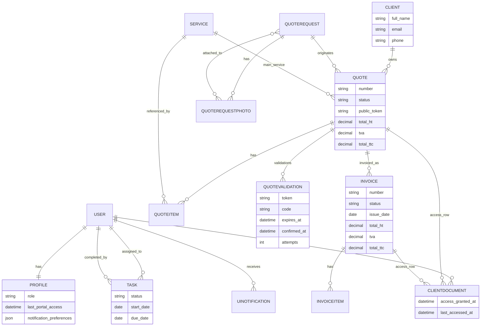
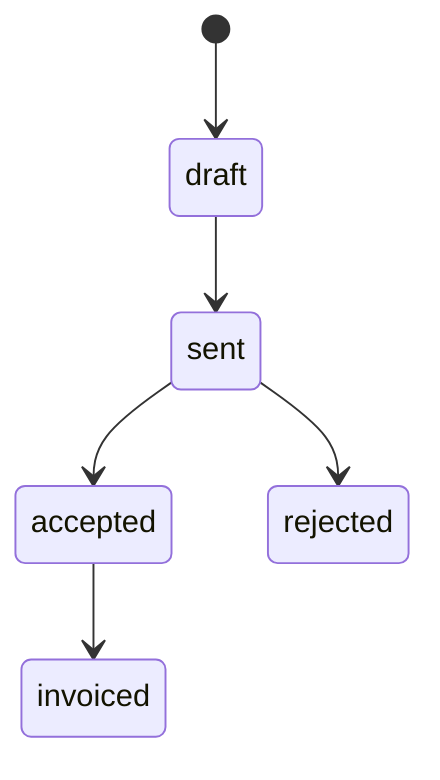
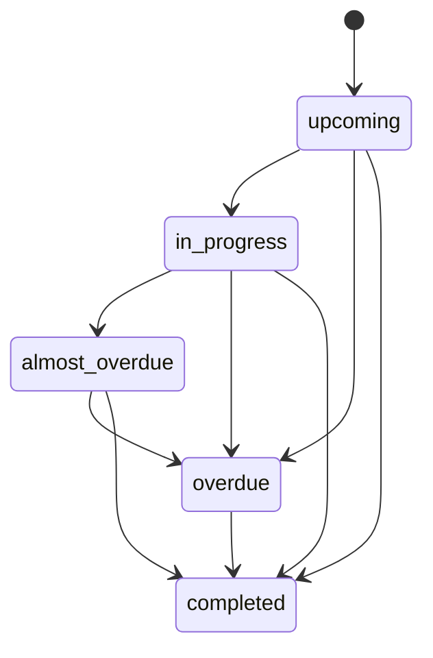

## Backend ERP (Django) — NetExpress

Ce document complète `docs/ARCHITECTURE.md` avec les **sorties attendues** côté backend ERP : **schémas de modèles**, **services métier**, **flux fonctionnels**, **stratégie rôles/permissions**.

---

## 1) Rôles (mapping métier ↔ technique)

- **Client** → `Profile.role = client` → portail `/client/`
- **Worker** → `Profile.role = worker` (ou groupe Django `Workers` en compat) → portail `/worker/`
- **Admin** → `Profile.role = admin_business` → portail `/admin-dashboard/` + lecture `/gestion/`
- **Admin avancé** → `Profile.role = admin_technical` ou `is_superuser` → portail `/gestion/` uniquement

Contrôle d’accès centralisé aujourd’hui :
- middleware: `accounts/middleware.py` (`RoleBasedAccessMiddleware`)
- décorateurs: `core/decorators.py` (et `decorators_v2.py` legacy)

---

## 2) Schémas de modèles (domaine ERP)

### 2.1 Noyau identité / rôles

- `auth.User` (Django)
- `accounts.Profile`
  - `user (OneToOne)`
  - `role` ∈ {`client`, `worker`, `admin_business`, `admin_technical`}
  - `last_portal_access`, `notification_preferences`

### 2.2 Devis

- `devis.Client`
  - contact “métier” pour devis (nom/email/tel/adresse…)
- `devis.QuoteRequest` (+ `QuoteRequestPhoto`)
  - demande initiale (site/public)
- `devis.Quote`
  - `client (FK)`
  - `quote_request (FK nullable)`
  - `service (FK nullable)` + `QuoteItem[]`
  - `status` ∈ {draft, sent, accepted, rejected, invoiced}
  - `public_token` (lien stable PDF/validation)
  - totaux `total_ht`, `tva`, `total_ttc`
  - `pdf` (document généré)
- `devis.QuoteItem`
  - `quote (FK)`
  - `service (FK nullable)` + `description`, `quantity`, `unit_price`, `tax_rate`
- `devis.QuoteValidation` (workflow 2FA)
  - `quote (FK)`
  - `token` (unique), `code`, `expires_at`, `confirmed_at`, `attempts`

### 2.3 Factures

- `factures.Invoice`
  - `quote (FK nullable)`
  - `number`, `issue_date`, `due_date`
  - `status` (draft/sent/paid/…)
  - totaux `total_ht`, `tva`, `total_ttc`, `discount`
  - `pdf`
- `factures.InvoiceItem`
  - `invoice (FK)`
  - `description`, `quantity` (int), `unit_price`, `tax_rate`

### 2.4 Tâches / interventions (actuel)

NetExpress n’a pas encore un modèle “Intervention” dédié : le suivi opérationnel passe par `tasks.Task`.

- `tasks.Task`
  - `assigned_to (FK User)` (nullable) + `completed_by (FK User)` + `completion_notes`
  - `start_date`, `due_date`
  - `status` ∈ {upcoming, in_progress, almost_overdue, overdue, completed}

### 2.5 Accès documents & notifications

- `core.ClientDocument`
  - “ACL” d’accès client à un `Quote` ou un `Invoice` (exactement un des deux)
- `core.UINotification`
  - notifications UI (types: task_assigned, quote_validated, invoice_created, …)
- `core.PortalSession`
  - tracking sessions portail

### 2.6 Diagramme (ERD simplifié)

### 2.7 Machines d’état (cible)

---

## 3) Services métier (Service Layer / Use-cases)

### 3.1 Convention (cible)

- **Views**: orchestration HTTP uniquement (input → appel service → output)
- **Application** (`*/application/`) : use-cases, transactions, orchestration (modèles, emails, PDF, notifications)
- **Domain** (`*/domain/`) : règles pures testables (pas d’import Django)
- **Infrastructure**: adapters (PDF, email, ORM repositories) — déjà présent partiellement (`core/services`, `weasyprint_adapter`, `django_orm`, `hexcore`)

### 3.2 Exemples actuels (dans le repo)

- `devis/application/quote_validation.py`
  - `start_quote_validation(...)` (création token + envoi OTP)
  - `confirm_quote_validation_code(...)` (validation + effets: status, PDF, notification)
- `devis/services.py`
  - `create_invoice_from_quote(...)` (use-case facturation depuis devis accepté)
- `tasks/domain/status.py` + `tasks/application/status.py`
  - calcul/alignement statut tâche hors vues
- `hexcore/services/invoice_service.py`
  - service applicatif “hexagonal” (factures) — expérimental

---

## 4) Flux fonctionnels backend (workflows)

### 4.1 Demande de devis (public)

1. POST `/devis/…` → création `QuoteRequest` (+ photos)
2. Back-office : création `Quote` + `QuoteItem[]`
3. Génération PDF + envoi mail premium (pièce jointe + liens)

### 4.2 Validation devis (2FA, client)

1. Client clique “Valider le devis” (lien stable `Quote.public_token`)
2. Backend crée un `QuoteValidation` (token+code, TTL) et envoie le code par email
3. Client saisit le code
4. Si OK:
   - `Quote.status = accepted`
   - PDF régénéré (best-effort)
   - notification admins (UI/email)

### 4.3 Conversion devis → facture

Précondition: devis **accepté**.

1. Use-case `create_invoice_from_quote`
2. Copie `QuoteItem[]` → `InvoiceItem[]`
3. Recalcul totaux facture + génération PDF (selon flux)
4. `Quote.status = invoiced`

### 4.4 Exécution (tâches)

1. Admin crée `Task` et l’assigne à un worker
2. Le worker voit ses tâches sur `/worker/`
3. À la complétion :
   - `Task.status = completed`
   - `completed_by`, `completion_notes`
   - notifications admins (si activé)

---

## 5) Stratégie permissions & intégrité

### 5.1 Contrôle “macro” (portails)

Objectif : empêcher tout “cross-portal”.

- **Technique**: middleware `RoleBasedAccessMiddleware` redirige selon rôle + bloque l’écriture `/gestion/` pour `admin_business`
- **Principe**: un utilisateur a **un portail canonique** (sauf superuser support)

### 5.2 Autorisations “métier” (object-level)

Objectif : un client ne voit que **ses** documents.

Pattern recommandé (cible) :
- `core.ClientDocument` = table d’accès explicite (= source de vérité ACL)
- `ClientDocumentService` = *seule source de vérité* pour `can_access_*` + tracking

État actuel (dans le code) :
- `ClientDocumentService.can_access_*` s’appuie sur **l’email** du `User` qui matche `Client.email` (et `ClientDocument` sert surtout au **tracking**).
- amélioration recommandée : basculer progressivement vers une ACL explicite (via `ClientDocument`) ou un lien fort `devis.Client ↔ auth.User` afin d’éviter les effets de bord (changement d’email, homonymies, etc.).

### 5.3 Matrice simplifiée (cible)

- **Client**
  - `Quote`: read (si ACL), validate (si SENT), download PDF (si ACL)
  - `Invoice`: read/download (si ACL)
  - `Task`: aucun accès direct (sauf si un futur modèle “Intervention” l’exige)
- **Worker**
  - `Task`: read (assignées), complete (assignées)
  - `Quote/Invoice`: read éventuel (si besoin opérationnel, sinon interdit)
- **Admin**
  - CRUD devis/factures/tâches + gestion workers/clients (portail business)
  - Lecture `/gestion/` (Django admin), pas d’écriture
- **Admin avancé**
  - Django admin complet (`/gestion/`)

### 5.4 Intégrité / sécurité (règles)

- **Transactions** sur use-cases multi-objets (ex: devis→facture, validation)
- **Idempotence** : éviter doubles factures / doubles validations (déjà fait via `QuoteValidation.create_for_quote()` qui invalide les précédents)
- **Best-effort** sur emails/PDF/notifications: la transaction métier ne doit pas échouer pour un incident d’infra

