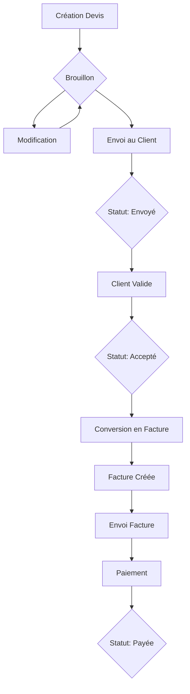
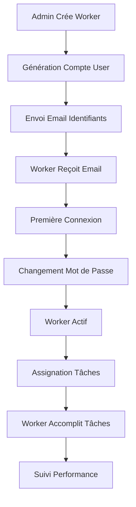
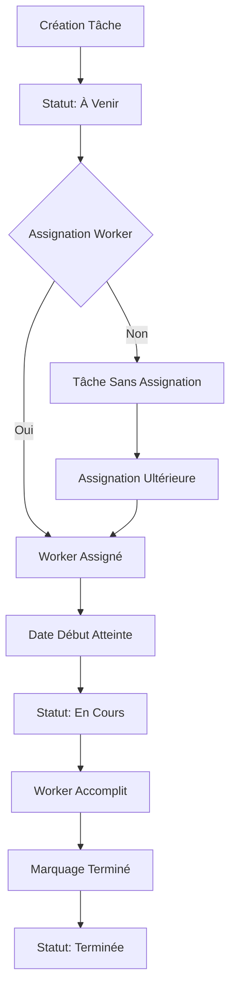

# Interface de Gestion Métier - NetExpress

**Version :** 1.0  
**Date :** 28 Décembre 2025  
**Auteur :** Architecte Produit / Développeur Senior  
**Statut :** Spécification complète

---

## Table des matières

1. [Vision Globale](#1-vision-globale)
2. [Architecture de l'Interface](#2-architecture-de-linterface)
3. [Modules et Pages](#3-modules-et-pages)
4. [Flux Métiers](#4-flux-métiers)
5. [Règles d'Accès et Permissions](#5-règles-daccès-et-permissions)
6. [Structure Technique](#6-structure-technique)
7. [Recommandations d'Implémentation](#7-recommandations-dimplémentation)

---

## 1. Vision Globale

### 1.1 Objectif

L'interface de gestion métier (`/admin-dashboard/`) est le **cœur opérationnel** de NetExpress. Elle permet aux équipes de gestion de piloter l'activité quotidienne de l'entreprise sans dépendre de l'interface technique Django Admin (`/gestion/`).

### 1.2 Principes Fondamentaux

| Principe | Description |
|----------|-------------|
| **Autonomie métier** | Interface complète permettant toutes les opérations courantes |
| **Séparation claire** | Distincte de l'admin Django/Jazzmin (technique) |
| **Simplicité** | Interface intuitive pour utilisateurs non techniques |
| **Robustesse** | Logique métier centralisée, permissions côté serveur |
| **Évolutivité** | Architecture modulaire pour faciliter les extensions |

### 1.3 Profils Utilisateurs

| Profil | Description | Rôle Django | Usage Principal |
|--------|-------------|-------------|-----------------|
| **Administrateur métier** | Responsable de la gestion opérationnelle | `admin_business` | Pilotage complet, décisions métier |
| **Gestionnaire / Secrétaire** | Gestion quotidienne, support client | `admin_business` | Création devis/factures, suivi planning |
| **Responsable d'exploitation** | Coordination opérationnelle, suivi performance | `admin_business` | Tableaux de bord, KPIs, reporting |

**Note importante :** Tous ces profils utilisent le même rôle `admin_business` avec accès à `/admin-dashboard/`.

---

## 2. Architecture de l'Interface

### 2.1 Structure de Navigation

```
/admin-dashboard/
├── Dashboard (accueil)
├── Gestion des Clients
│   ├── Liste des clients
│   ├── Détail client
│   ├── Création client
│   └── Historique client
├── Gestion des Workers
│   ├── Liste des workers
│   ├── Détail worker
│   ├── Création worker
│   └── Performance worker
├── Gestion des Devis
│   ├── Liste des devis
│   ├── Détail devis
│   ├── Création devis
│   ├── Envoi devis
│   └── Suivi validation
├── Gestion des Factures
│   ├── Liste des factures
│   ├── Détail facture
│   ├── Création facture
│   ├── Conversion devis → facture
│   └── Suivi paiements
├── Planning et Tâches
│   ├── Vue calendrier
│   ├── Liste des tâches
│   ├── Détail tâche
│   ├── Création tâche
│   └── Affectation workers
├── Tableaux de Bord
│   ├── KPIs globaux
│   ├── Évolution CA
│   ├── Performance équipe
│   └── Reporting personnalisé
└── Messagerie (liens vers messaging/)
```

### 2.2 Layout Principal

L'interface suit un layout standard avec :

- **Header** : Logo, navigation principale, notifications, profil utilisateur
- **Sidebar** : Navigation secondaire (rétractable)
- **Contenu principal** : Zone de travail avec breadcrumbs
- **Footer** : Informations légères (version, support)

### 2.3 Responsive Design

- **Desktop** : Layout complet avec sidebar fixe
- **Tablette** : Sidebar rétractable, navigation adaptée
- **Mobile** : Menu hamburger, navigation simplifiée (usage limité)

---

## 3. Modules et Pages

### 3.1 Dashboard (Accueil)

**URL :** `/admin-dashboard/`  
**Fonction :** Vue d'ensemble de l'activité

#### Éléments Principaux

1. **KPIs en en-tête** (4 cartes)
   - CA du mois (Total TTC factures payées)
   - CA en attente (Factures envoyées non payées)
   - Montant impayé (Factures en retard)
   - Taux de conversion (Devis acceptés / Devis envoyés)

2. **Graphiques**
   - Évolution CA (ligne) : 12 derniers mois
   - Répartition statuts devis (camembert)
   - Répartition statuts factures (camembert)
   - Performance workers (barres) : Top 5 du mois

3. **Listes récentes** (3 colonnes)
   - Devis récents (5 derniers)
   - Factures récentes (5 dernières)
   - Tâches du jour (à venir + en cours)

4. **Actions rapides**
   - Boutons : [+ Devis] [+ Facture] [+ Tâche] [+ Client] [+ Worker]

#### Logique Métier

```python
# Calculs KPIs dans la vue (ou service dédié)
- CA mois = Sum(total_ttc) WHERE invoice.status IN ('paid', 'partial') AND issue_date >= début_mois
- CA attente = Sum(total_ttc) WHERE invoice.status = 'sent'
- Montant impayé = Sum(total_ttc) WHERE invoice.status = 'overdue'
- Taux conversion = (Count(quotes WHERE status='accepted') / Count(quotes WHERE status IN ('sent', 'accepted', 'rejected'))) * 100
```

---

### 3.2 Module : Gestion des Clients

#### 3.2.1 Liste des Clients

**URL :** `/admin-dashboard/clients/`  
**Fonction :** Vue table avec recherche, filtres, pagination

**Colonnes du tableau :**
- Nom complet
- Email
- Téléphone
- Entreprise (si renseignée)
- Nombre de devis
- Nombre de factures
- Dernière activité (date)
- Actions (Voir, Modifier, Historique)

**Filtres disponibles :**
- Recherche texte (nom, email, téléphone, entreprise)
- Clients avec devis en attente
- Clients avec factures impayées
- Tri : Nom, Date création, Dernière activité

**Actions :**
- [+ Nouveau client] (bouton en haut à droite)
- Export CSV (optionnel)

#### 3.2.2 Détail Client

**URL :** `/admin-dashboard/clients/<id>/`  
**Fonction :** Vue complète d'un client

**Sections :**
1. **Informations générales** (carte)
   - Nom, email, téléphone, adresse complète
   - Entreprise, SIREN (si applicable)
   - Date de création, dernière activité
   - Actions : [Modifier] [Supprimer]

2. **Devis associés** (tableau)
   - Liste des devis avec statut, montant, date
   - Lien vers détail devis
   - Actions : [Créer devis]

3. **Factures associées** (tableau)
   - Liste des factures avec statut, montant, date
   - Lien vers détail facture
   - Actions : [Créer facture]

4. **Historique** (timeline)
   - Chronologie des interactions (devis, factures, tâches)

#### 3.2.3 Création Client

**URL :** `/admin-dashboard/clients/create/`  
**Fonction :** Formulaire de création

**Champs requis :**
- Nom complet *
- Email *
- Téléphone *

**Champs optionnels :**
- Entreprise
- Adresse complète (ligne, ville, code postal)
- Notes internes

**Validation :**
- Email unique (si client existe déjà, afficher message avec lien)
- Format téléphone
- Sauvegarde → Redirection vers détail client

**Règles métier :**
- Un client peut être créé manuellement OU via inscription publique
- Si création manuelle : pas de compte User associé initialement
- Possibilité de lier un compte User existant (si email correspond)

---

### 3.3 Module : Gestion des Workers

#### 3.3.1 Liste des Workers

**URL :** `/admin-dashboard/workers/`  
**Fonction :** Liste des workers avec statistiques

**Colonnes :**
- Nom complet (User)
- Email
- Téléphone
- Tâches assignées (en cours)
- Tâches terminées (mois en cours)
- Performance (moyenne)
- Statut (Actif / Inactif)
- Actions (Voir, Modifier, Désactiver)

**Filtres :**
- Recherche (nom, email)
- Workers actifs uniquement
- Tri : Nom, Performance, Nombre tâches

#### 3.3.2 Création Worker

**URL :** `/admin-dashboard/workers/create/`  
**Fonction :** Formulaire de création worker

**⚠️ RÈGLE FONDAMENTALE :** Les workers ne peuvent JAMAIS créer leur compte eux-mêmes. Ils sont créés UNIQUEMENT par un utilisateur de gestion.

**Processus :**
1. Saisie des informations (nom, email, téléphone)
2. Génération automatique d'un mot de passe temporaire
3. Création du User + Profile (role='worker')
4. Envoi email avec :
   - Lien de connexion
   - Identifiants (email + mot de passe temporaire)
   - Instruction de changement de mot de passe

**Champs :**
- Nom complet *
- Email * (vérification unicité)
- Téléphone *
- Notes internes

**Actions post-création :**
- [Envoyer identifiants] (si email non envoyé)
- [Modifier mot de passe] (administrateur)
- [Désactiver compte] (désactivation User.is_active = False)

#### 3.3.3 Détail Worker

**URL :** `/admin-dashboard/workers/<id>/`  
**Fonction :** Vue détaillée d'un worker

**Sections :**
1. **Informations générales**
   - Coordonnées, statut
   - Date de création, dernière connexion
   - Actions : [Modifier] [Envoyer identifiants] [Désactiver]

2. **Tâches assignées** (tableau)
   - Tâches en cours, à venir, terminées
   - Performance (taux de complétion, retards)

3. **Planning** (vue calendrier compacte)
   - Tâches du mois avec dates

4. **Statistiques** (cartes)
   - Tâches totales, terminées, en retard
   - Moyenne de complétion à temps

---

### 3.4 Module : Gestion des Devis

#### 3.4.1 Liste des Devis

**URL :** `/admin-dashboard/quotes/`  
**Fonction :** Tableau de tous les devis

**Colonnes :**
- Numéro devis
- Client
- Montant TTC
- Date émission
- Statut (badge coloré)
- Validité jusqu'à
- Actions (Voir, Modifier, Envoyer, Convertir)

**Filtres :**
- Statut (Brouillon, Envoyé, Accepté, Refusé, Facturé)
- Client (recherche)
- Période (date émission)
- Devis expirés

**Statuts :**
- `draft` : Brouillon (gris)
- `sent` : Envoyé (jaune)
- `accepted` : Accepté (vert)
- `rejected` : Refusé (rouge)
- `invoiced` : Facturé (bleu)

#### 3.4.2 Détail Devis

**URL :** `/admin-dashboard/quotes/<id>/`  
**Fonction :** Vue complète d'un devis

**Sections :**
1. **En-tête** (bandeau)
   - Numéro devis, statut, dates
   - Client (lien)
   - Actions : [Modifier] [Envoyer email] [Générer PDF] [Convertir en facture]

2. **Lignes de devis** (tableau)
   - Service / Description
   - Quantité, Prix unitaire, TVA, Total
   - Actions : [Modifier] [Supprimer] (si brouillon)

3. **Totaux** (panneau latéral ou bas)
   - Sous-total HT
   - TVA
   - Total TTC
   - [Ajouter ligne] (si brouillon)

4. **Informations complémentaires**
   - Message (si renseigné)
   - Service principal (si applicable)
   - Demande d'origine (lien vers QuoteRequest si applicable)

5. **Historique** (timeline)
   - Création, envoi, validation, conversion

#### 3.4.3 Création Devis

**URL :** `/admin-dashboard/quotes/create/`  
**Fonction :** Formulaire de création devis

**Processus en 3 étapes :**

**Étape 1 : Client**
- Recherche client existant (autocomplete)
- OU [Créer nouveau client] (modal ou nouvelle page)

**Étape 2 : Lignes de devis**
- Tableau dynamique :
  - Service (select avec recherche) OU Description libre
  - Quantité, Prix unitaire, Taux TVA (défaut 20%)
  - Total ligne (calculé automatiquement)
- [Ajouter ligne]
- Calcul automatique des totaux

**Étape 3 : Validation**
- Aperçu des totaux
- Message optionnel
- Date de validité (optionnelle)
- Actions :
  - [Enregistrer brouillon]
  - [Enregistrer et envoyer] (change statut → 'sent' + envoi email)

#### 3.4.4 Envoi Devis par Email

**URL :** `/admin-dashboard/quotes/<id>/send-email/`  
**Fonction :** Envoi du devis au client par email

**Processus :**
1. Vérification que le devis n'est pas déjà facturé
2. Génération PDF (si nécessaire)
3. Envoi email avec :
   - Lien de consultation
   - PDF en pièce jointe
   - Instructions de validation
4. Mise à jour statut → 'sent'
5. Enregistrement de la date d'envoi
6. Notification admin (optionnel)

---

### 3.5 Module : Gestion des Factures

#### 3.5.1 Liste des Factures

**URL :** `/admin-dashboard/invoices/`  
**Fonction :** Tableau de toutes les factures

**Colonnes :**
- Numéro facture
- Client
- Devis source (lien si applicable)
- Montant TTC
- Date émission
- Échéance
- Statut (badge)
- Actions (Voir, Modifier, Envoyer, Marquer payée)

**Filtres :**
- Statut (Brouillon, Envoyée, Payée, Partiellement payée, En retard)
- Client
- Période
- Factures impayées
- Factures en retard

#### 3.5.2 Détail Facture

**URL :** `/admin-dashboard/invoices/<id>/`  
**Fonction :** Vue complète d'une facture

**Sections similaires au devis :**
1. En-tête avec statut et actions
2. Lignes de facture
3. Totaux
4. Informations paiement (conditions, échéance)
5. Historique paiements (si partiel)
6. Historique (timeline)

**Actions spécifiques :**
- [Marquer payée] (change statut + enregistre date)
- [Marquer partiellement payée] (ajoute montant partiel)
- [Envoyer relance] (si impayée)

#### 3.5.3 Création Facture

**URL :** `/admin-dashboard/invoices/create/`  
**Fonction :** Création manuelle ou conversion devis

**Deux modes :**

**Mode 1 : Conversion Devis**
- Sélection d'un devis accepté
- Pré-remplissage avec données du devis
- Validation → Création facture liée

**Mode 2 : Création Manuelle**
- Processus similaire au devis
- Champs supplémentaires :
  - Référence bon de commande client
  - Conditions de paiement
  - Date d'échéance

#### 3.5.4 Conversion Devis → Facture

**Workflow :**
1. Depuis détail devis accepté : [Convertir en facture]
2. Vérification :
   - Devis non déjà facturé
   - Devis accepté
3. Création facture avec :
   - Lignes copiées du devis
   - Totaux recalculés
   - Référence au devis (quote foreign key)
4. Mise à jour statut devis → 'invoiced'
5. Redirection vers détail facture

---

### 3.6 Module : Planning et Tâches

#### 3.6.1 Vue Calendrier

**URL :** `/admin-dashboard/planning/`  
**Fonction :** Calendrier interactif des tâches

**Vues disponibles :**
- Mois (par défaut)
- Semaine
- Jour
- Liste (tableau)

**Affichage :**
- Tâches affichées par date de début
- Couleur par statut :
  - À venir : bleu
  - En cours : vert
  - Terminée : gris
  - En retard : rouge
- Clic sur tâche → modal détail rapide
- Drag & drop pour réassignation (optionnel, avancé)

**Filtres :**
- Worker (toutes ou un worker spécifique)
- Statut
- Période

#### 3.6.2 Liste des Tâches

**URL :** `/admin-dashboard/tasks/`  
**Fonction :** Tableau de toutes les tâches

**Colonnes :**
- Titre
- Worker assigné
- Date début
- Date échéance
- Statut
- Localisation
- Actions (Voir, Modifier, Réassigner)

**Filtres :**
- Statut
- Worker
- Période
- Tâches en retard
- Tâches sans assignation

#### 3.6.3 Détail Tâche

**URL :** `/admin-dashboard/tasks/<id>/`  
**Fonction :** Vue complète d'une tâche

**Sections :**
1. **Informations générales**
   - Titre, description, localisation
   - Dates, statut
   - Worker assigné (avec lien)
   - Actions : [Modifier] [Réassigner] [Supprimer]

2. **Historique**
   - Création, assignation, changements statut
   - Notes de complétion (si terminée)

3. **Documents associés** (si applicable)
   - Photos avant/après
   - Documents joints

#### 3.6.4 Création Tâche

**URL :** `/admin-dashboard/tasks/create/`  
**Fonction :** Formulaire de création

**Champs :**
- Titre *
- Description
- Localisation
- Équipe (champ libre, info interne)
- Date début * (défaut : aujourd'hui)
- Date échéance *
- Worker assigné (select, optionnel)
- Notes internes

**Validation :**
- Date échéance >= Date début
- Sauvegarde → statut calculé automatiquement

---

### 3.7 Module : Tableaux de Bord Avancés

#### 3.7.1 KPIs Globaux

**URL :** `/admin-dashboard/analytics/`  
**Fonction :** Tableau de bord analytique complet

**Métriques :**
- CA total (année)
- CA par mois (graphique)
- Nombre de clients actifs
- Nombre de devis (taux de conversion)
- Nombre de factures (taux de paiement)
- Performance workers (top 10)
- Services les plus demandés

**Périodes :**
- Sélection : Mois, Trimestre, Année, Personnalisé

#### 3.7.2 Reporting Personnalisé

**URL :** `/admin-dashboard/reports/`  
**Fonction :** Génération de rapports

**Rapports disponibles :**
- CA par client
- CA par service
- Performance workers
- Taux de conversion devis
- Factures impayées (liste détaillée)
- Planning prévisionnel

**Export :**
- CSV
- PDF (optionnel)

---

## 4. Flux Métiers

### 4.1 Flux : Cycle Devis → Facture



**Étapes détaillées :**

1. **Création Devis**
   - Admin crée devis depuis `/admin-dashboard/quotes/create/`
   - Statut initial : `draft`
   - Sauvegarde possible en brouillon

2. **Envoi au Client**
   - Admin envoie devis via [Envoyer email]
   - Statut → `sent`
   - Email envoyé avec lien de consultation + PDF

3. **Validation Client**
   - Client valide depuis son portail (`/client/quotes/<id>/validate/`)
   - Validation 2FA (code email/SMS)
   - Statut → `accepted`

4. **Conversion Facture**
   - Admin convertit depuis détail devis
   - Vérification : devis accepté + non facturé
   - Création facture avec lignes copiées
   - Statut devis → `invoiced`

5. **Paiement**
   - Admin marque facture payée manuellement
   - OU : Suivi automatique si intégration paiement (futur)

### 4.2 Flux : Création et Gestion Worker



**Règles critiques :**
- ⚠️ Workers ne créent JAMAIS leur compte
- ⚠️ Création UNIQUEMENT par admin depuis `/admin-dashboard/workers/create/`
- ⚠️ Mot de passe temporaire obligatoire
- ⚠️ Email d'activation automatique

### 4.3 Flux : Création Client

**Deux scénarios :**

**Scénario A : Inscription Publique**
1. Client s'inscrit depuis formulaire public
2. Création automatique :
   - User (avec email)
   - Profile (role='client')
   - Client (devis.models.Client)
3. Lien User ↔ Client (via email)
4. Accès portail client automatique

**Scénario B : Création Manuelle Admin**
1. Admin crée client depuis `/admin-dashboard/clients/create/`
2. Création uniquement du Client (pas de User)
3. Possibilité de lier un User existant (si email correspond)
4. OU : Inviter le client (envoi email avec lien d'inscription)

### 4.4 Flux : Planning et Affectation



---

## 5. Règles d'Accès et Permissions

### 5.1 Rôles et Permissions

**Rôle : `admin_business`**

**Permissions complètes :**

| Domaine | Permissions |
|---------|-------------|
| **Clients** | Voir, Créer, Modifier, Supprimer, Historique |
| **Workers** | Voir, Créer, Modifier, Désactiver, Statistiques |
| **Devis** | Voir, Créer, Modifier, Supprimer, Envoyer, Convertir |
| **Factures** | Voir, Créer, Modifier, Supprimer, Envoyer, Marquer payée |
| **Tâches** | Voir, Créer, Modifier, Supprimer, Assigner, Réassigner |
| **Planning** | Vue complète, Modification |
| **Tableaux de bord** | Accès complet |
| **Reporting** | Génération, Export |

### 5.2 Contrôle d'Accès Côté Serveur

**⚠️ RÈGLE FONDAMENTALE :** Toutes les vérifications de permissions sont effectuées **côté serveur**. Aucune élévation de privilège n'est possible côté client.

**Implémentation :**

```python
# Décorateurs dans core/decorators.py
@admin_portal_required  # Vérifie role == 'admin_business'
def admin_dashboard(request):
    ...

# Vérification dans chaque vue
from core.decorators import admin_portal_required
from accounts.portal import get_user_role

@admin_portal_required
def admin_create_worker(request):
    if get_user_role(request.user) != 'admin_business':
        raise PermissionDenied
    ...
```

### 5.3 Règles Métier Spécifiques

#### Règle 1 : Workers ne peuvent pas s'inscrire

```python
# Dans accounts/views.py (inscription publique)
def register(request):
    # Création User + Profile
    profile.role = Profile.ROLE_CLIENT  # TOUJOURS client, jamais worker
    ...
```

#### Règle 2 : Rôles contrôlés uniquement côté serveur

```python
# INTERDIT : Modifier role depuis formulaire client
# CORRECT : Modifier role uniquement via admin ou service backend
from accounts.services import create_worker_account

def admin_create_worker(request):
    # Service backend garantit le rôle
    create_worker_account(email, ...)  # Force role='worker'
    ...
```

#### Règle 3 : Conversion devis → facture

```python
# Vérifications obligatoires avant conversion
def convert_quote_to_invoice(quote_id, user):
    quote = Quote.objects.get(id=quote_id)
    
    # Vérifications
    if quote.status != Quote.QuoteStatus.ACCEPTED:
        raise ValidationError("Devis non accepté")
    if quote.invoices.exists():
        raise ValidationError("Devis déjà facturé")
    
    # Conversion
    invoice = Invoice.objects.create(...)
    quote.status = Quote.QuoteStatus.INVOICED
    quote.save()
    ...
```

---

## 6. Structure Technique

### 6.1 Architecture des Vues

**Principe :** Vues Django classiques (FBV ou CBV), logique métier dans services.

**Structure recommandée :**

```
core/
├── views.py                    # Vues principales admin-dashboard
├── views_management.py         # Vues gestion clients/workers (optionnel)
├── services/
│   ├── client_service.py       # Services métier clients
│   ├── worker_service.py       # Services métier workers
│   └── dashboard_service.py    # Calculs KPIs, statistiques
```

**Exemple de vue :**

```python
# core/views.py
from core.decorators import admin_portal_required
from core.services.dashboard_service import DashboardService

@admin_portal_required
def admin_dashboard(request):
    """Dashboard principal admin-dashboard."""
    service = DashboardService()
    
    context = {
        'kpis': service.get_kpis(),
        'recent_quotes': service.get_recent_quotes(limit=5),
        'recent_invoices': service.get_recent_invoices(limit=5),
        'today_tasks': service.get_today_tasks(),
    }
    
    return render(request, 'core/admin_dashboard.html', context)
```

### 6.2 Services Métier

**Principe :** Toute logique métier complexe doit être dans des services.

**Services recommandés :**

```python
# core/services/client_service.py
class ClientService:
    def create_client(self, data, user):
        """Création client avec validation."""
        # Validation email unique
        # Création Client
        # Lien User si email correspond
        ...
    
    def link_client_to_user(self, client, user):
        """Lie un client à un User existant."""
        ...

# core/services/worker_service.py
class WorkerService:
    def create_worker(self, data, admin_user):
        """Création worker avec génération compte."""
        # Création User
        # Création Profile (role='worker')
        # Génération mot de passe temporaire
        # Envoi email identifiants
        ...
    
    def generate_temporary_password(self):
        """Génère un mot de passe temporaire sécurisé."""
        ...

# devis/services.py (existant)
class QuoteService:
    def convert_to_invoice(self, quote, user):
        """Conversion devis → facture avec vérifications."""
        ...
```

### 6.3 Templates

**Structure :**

```
templates/
├── base_v2.html                # Template de base (existant)
├── core/
│   ├── admin_dashboard.html
│   ├── admin_clients_list.html
│   ├── admin_client_detail.html
│   ├── admin_client_create.html
│   ├── admin_workers_list.html
│   ├── admin_worker_detail.html
│   ├── admin_worker_create.html
│   ├── admin_quotes_list.html
│   ├── admin_quote_detail.html
│   ├── admin_quote_create.html
│   ├── admin_invoices_list.html
│   ├── admin_invoice_detail.html
│   ├── admin_invoice_create.html
│   ├── admin_tasks_list.html
│   ├── admin_task_detail.html
│   ├── admin_task_create.html
│   └── admin_planning.html
└── includes/
    ├── admin_nav.html          # Navigation sidebar
    ├── admin_kpi_card.html     # Composant KPI
    └── admin_status_badge.html # Badge statut
```

### 6.4 URLs

**Structure :**

```python
# core/urls.py (déjà partiellement en place)
urlpatterns = [
    # Dashboard
    path('admin-dashboard/', views.admin_dashboard, name='admin_dashboard'),
    
    # Clients
    path('admin-dashboard/clients/', views.admin_clients_list, name='admin_clients_list'),
    path('admin-dashboard/clients/<int:pk>/', views.admin_client_detail, name='admin_client_detail'),
    path('admin-dashboard/clients/create/', views.admin_client_create, name='admin_client_create'),
    path('admin-dashboard/clients/<int:pk>/edit/', views.admin_client_edit, name='admin_client_edit'),
    
    # Workers
    path('admin-dashboard/workers/', views.admin_workers_list, name='admin_workers_list'),
    path('admin-dashboard/workers/<int:pk>/', views.admin_worker_detail, name='admin_worker_detail'),
    path('admin-dashboard/workers/create/', views.admin_worker_create, name='admin_worker_create'),
    
    # Devis (déjà partiellement en place)
    path('admin-dashboard/quotes/', views.admin_quotes_list, name='admin_quotes_list'),
    path('admin-dashboard/quotes/<int:pk>/', views.admin_quote_detail, name='admin_quote_detail'),
    path('admin-dashboard/quotes/create/', views.admin_create_quote, name='admin_create_quote'),
    
    # Factures
    path('admin-dashboard/invoices/', views.admin_invoices_list, name='admin_invoices_list'),
    path('admin-dashboard/invoices/<int:pk>/', views.admin_invoice_detail, name='admin_invoice_detail'),
    path('admin-dashboard/invoices/create/', views.admin_create_invoice, name='admin_create_invoice'),
    
    # Tâches
    path('admin-dashboard/tasks/', views.admin_tasks_list, name='admin_tasks_list'),
    path('admin-dashboard/tasks/<int:pk>/', views.admin_task_detail, name='admin_task_detail'),
    path('admin-dashboard/tasks/create/', views.admin_create_task, name='admin_create_task'),
    
    # Planning
    path('admin-dashboard/planning/', views.admin_planning, name='admin_planning'),
]
```

---

## 7. Recommandations d'Implémentation

### 7.1 Ordre de Priorité

**Phase 1 : Fondations (Semaine 1-2)**
1. ✅ Dashboard principal (KPIs, listes récentes)
2. ✅ Liste et détail clients
3. ✅ Création client

**Phase 2 : Gestion Workers (Semaine 2-3)**
1. ✅ Liste et détail workers
2. ✅ Création worker (avec service backend)
3. ✅ Envoi identifiants

**Phase 3 : Devis (Semaine 3-4)**
1. ✅ Liste et détail devis (amélioration si nécessaire)
2. ✅ Création devis (amélioration si nécessaire)
3. ✅ Envoi email devis

**Phase 4 : Factures (Semaine 4-5)**
1. ✅ Liste et détail factures
2. ✅ Création facture
3. ✅ Conversion devis → facture

**Phase 5 : Planning (Semaine 5-6)**
1. ✅ Liste tâches
2. ✅ Création tâche
3. ✅ Vue calendrier (basique)
4. ✅ Affectation workers

**Phase 6 : Avancé (Semaine 6+)**
1. Tableaux de bord analytiques
2. Reporting
3. Optimisations UX

### 7.2 Bonnes Pratiques

#### ✅ À FAIRE

- **Services métier** : Centraliser toute logique complexe
- **Permissions** : Vérifier côté serveur dans chaque vue
- **Validation** : Valider côté serveur (forms Django)
- **Messages** : Feedback utilisateur (success/error messages)
- **Pagination** : Pour toutes les listes (>20 items)
- **Recherche** : Autocomplete pour sélection clients/services
- **Erreurs** : Gestion gracieuse avec messages explicites

#### ❌ À ÉVITER

- **Logique métier dans templates** : Jamais de calculs complexes
- **Duplication** : Réutiliser les services existants
- **Permissions côté client** : Toujours vérifier côté serveur
- **Formulaires non validés** : Toujours utiliser Django Forms
- **Requêtes N+1** : Utiliser select_related/prefetch_related

### 7.3 Points d'Attention

1. **Performance**
   - Optimiser requêtes (select_related, prefetch_related)
   - Pagination systématique
   - Cache pour KPIs (si nécessaire)

2. **Sécurité**
   - CSRF activé (par défaut Django)
   - Validation côté serveur
   - Permissions strictes
   - Sanitisation inputs (XSS)

3. **UX**
   - Feedback immédiat (messages)
   - Confirmations pour actions destructives
   - États de chargement
   - Navigation claire (breadcrumbs)

4. **Maintenabilité**
   - Code documenté
   - Services testables
   - Templates réutilisables
   - Séparation des responsabilités

---

## 8. Checklist de Validation

### 8.1 Fonctionnalités

- [ ] Dashboard avec KPIs fonctionnels
- [ ] Gestion clients (CRUD complet)
- [ ] Gestion workers (CRUD + création compte)
- [ ] Gestion devis (CRUD + envoi + conversion)
- [ ] Gestion factures (CRUD + conversion)
- [ ] Gestion tâches (CRUD + affectation)
- [ ] Planning (vue calendrier)

### 8.2 Sécurité

- [ ] Permissions vérifiées côté serveur
- [ ] Workers ne peuvent pas créer leur compte
- [ ] Rôles contrôlés uniquement backend
- [ ] Validation formulaires
- [ ] CSRF activé

### 8.3 Qualité

- [ ] Logique métier dans services
- [ ] Pas de logique métier dans templates
- [ ] Code testé (tests unitaires recommandés)
- [ ] Documentation claire
- [ ] Performance optimisée

---

## 9. Annexes

### 9.1 Modèles de Données Clés

**Client (devis/models.py)**
```python
Client
- full_name
- email
- phone
- address_line
- city
- zip_code
- company
- created_at
```

**Quote (devis/models.py)**
```python
Quote
- number (unique)
- client (FK)
- status (draft, sent, accepted, rejected, invoiced)
- issue_date
- valid_until
- total_ht, tva, total_ttc
- quote_request (FK, optional)
```

**Invoice (factures/models.py)**
```python
Invoice
- number (unique)
- quote (FK, optional)
- client (via quote)
- status (draft, sent, paid, partial, overdue)
- issue_date
- due_date
- total_ht, tva, total_ttc
```

**Task (tasks/models.py)**
```python
Task
- title
- description
- location
- start_date
- due_date
- status (upcoming, in_progress, completed, overdue)
- assigned_to (FK User, optional)
- completed_by (FK User, optional)
```

**Profile (accounts/models.py)**
```python
Profile
- user (OneToOne)
- role (client, worker, admin_business, admin_technical)
- phone
- notification_preferences
```

### 9.2 Références

- **Architecture existante :** `docs/ARCHITECTURE.md`
- **UX/UI :** `docs/UX_UI_NetExpress.md`
- **Context projet :** `PROJECT_CONTEXT.txt`

---

**Document maintenu par l'équipe NetExpress**  
*Dernière mise à jour : 28 Décembre 2025*

